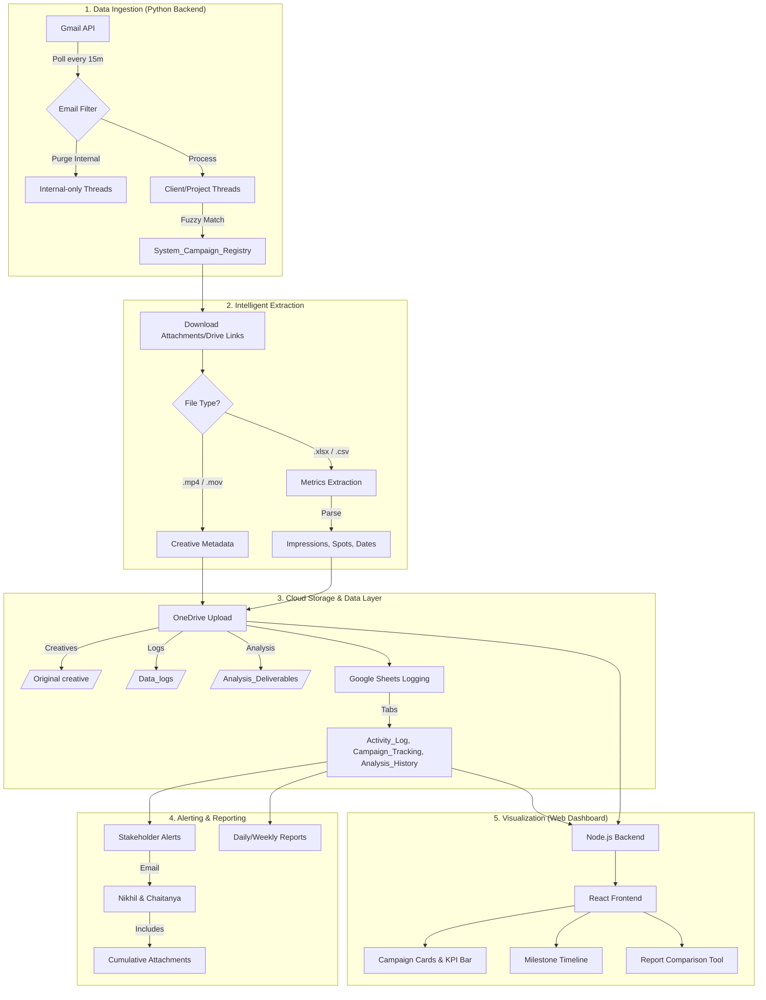
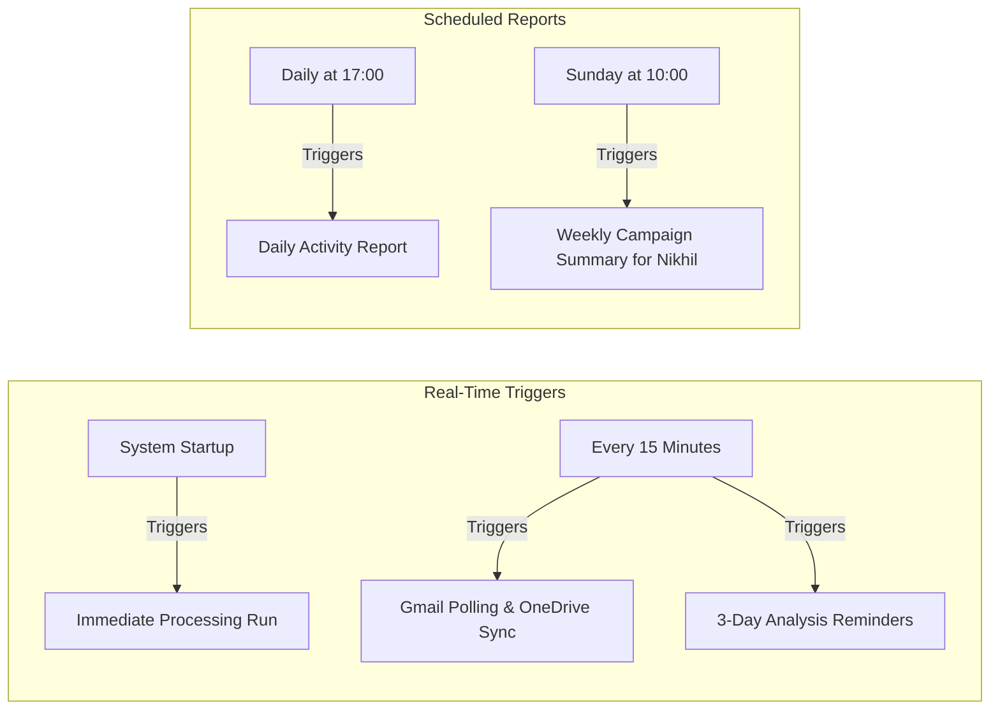
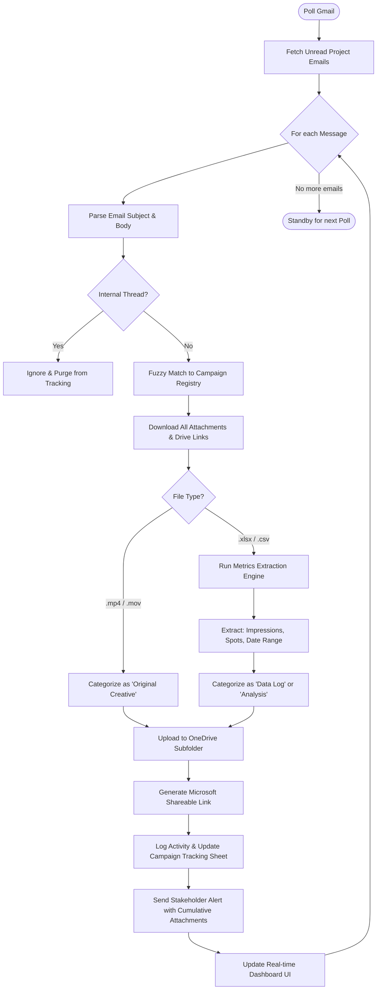

# 🔄 Project Management Automation: Complete Process Flow

This document outlines the end-to-end lifecycle of the **JioStar x Syncmedia** campaign automation system. It serves as a technical and operational reference for stakeholders and developers.

## 📊 System Architecture Diagram

---

## 🛠 Detailed Process Elements

### 1. Data Ingestion & Smart Filtering
*   **Source:** The system polls the Gmail API every 15 minutes for new project-related communications.
*   **Domain Constraint:** Only emails involving `@jiostar.com` or `@syncmedia.io` are processed.
*   **Internal Purge Rule:** Threads that are strictly internal (Syncmedia-to-Syncmedia) are purged from the tracking flow to ensure the dashboard reflects only client-facing campaign activity.
*   **Campaign Unification:** Uses fuzzy matching to group variations (e.g., "Realme 16 Pro", "Realme P4") into a single master campaign (e.g., **"Realme"**).

### 2. Automated Extraction & Isolation
*   **Thread Isolation:** Uses the **Gmail Thread ID** as a unique anchor for all data, preventing overlap between different campaigns.
*   **Metrics Extraction:** A specialized Python module parses `.xlsx` and `.csv` files to extract:
    *   **Impressions:** Scans for keywords like `TAM`, `Imp`, `Mn`, or `YouTube`.
    *   **LTV Spots:** Derived from the total row count of BARC client logs.
    *   **Dates:** Identifies the campaign duration by finding `MIN` and `MAX` values in date columns.

### 3. Organized Cloud Storage (OneDrive)
Files are automatically routed to a structured hierarchy in OneDrive (`/JHS X SYNC/`):
*   **/Original creative/:** Video files and assets.
*   **/Data_logs/:** Raw data received from the client.
*   **/Analysis_Deliverables/:** Processed reports generated by the team.

### 4. Alerting & Cumulative Reporting
*   **Stakeholder Sync:** Notifications are sent to `nikhil@syncmedia.io` and `chaitanya@syncmedia.io` for every key action.
*   **Cumulative Attachments:** Every notification email includes **all files** received throughout the entire history of that thread, ensuring full context is always available.
*   **Scheduled Reports:**
    *   **Daily:** Activity logs and progress updates.
    *   **Weekly (Sunday 10 AM):** High-level status summary for leadership.
    *   **Reminders:** 3-day pending alerts for items awaiting analysis.

### 5. Visibility Dashboard (The "Command Center")
*   **Frontend:** React (TypeScript) + Vite for a high-performance, interactive UI.
*   **Backend:** Node.js (Express) fetching real-time data from Google Sheets and OneDrive.
*   **Key Features:**
    *   **Campaign Cards:** Live status (Initiated, Data Received, Delivered).
    *   **KPI Bar:** Global summary of total campaigns, creatives, and delivery status.
    *   **Comparison Engine:** Side-by-side browser-based Excel comparison for report versioning.

---

## 💻 Tech Stack
| Component | Technology |
| :--- | :--- |
| **Orchestration** | Python 3.x |
| **Scheduling** | `schedule` library (Polling & Cron) |
| **Data Processing** | `pandas`, `openpyxl` |
| **Cloud Storage** | Microsoft Graph API (OneDrive) |
| **Data Layer** | Google Sheets API v4 |
| **Dashboard** | Node.js, React, TypeScript, Vanilla CSS |

---

## ⏰ Automation Triggers & Scheduling

The system operates based on four primary triggers, ensuring real-time data flow while maintaining regular status reporting.

### Trigger Breakdown:
1.  **Polling & Extraction (Every 15m):**
    *   **Action:** Fetches unread project emails, extracts metrics, uploads to OneDrive, and updates the Dashboard.
    *   **Context:** Ensures the Syncmedia team is alerted as soon as client data hits the inbox.
2.  **3-Day Pending Analysis Alerts:**
    *   **Action:** Scans `Campaign_Tracking` for rows with `Status = 'Email Received'` where the date is >3 days old.
    *   **Target:** Sends a reminder to Chaitanya for pending deliverables.
3.  **Daily Activity Report (17:00 Daily):**
    *   **Action:** Summarizes all activity from the `Activity_Log` for the day.
    *   **Target:** General team update on project movement.
4.  **Weekly Status Summary (Sundays 10:00 AM):**
    *   **Action:** Compiles a high-level status of all active campaigns from the `System_Campaign_Registry`.
    *   **Target:** Direct email to Nikhil for executive oversight.

---

## 🌊 Operational Campaign Lifecycle (Step-by-Step Logic)

The following flowchart explains the internal decision-making process for every email processed:

